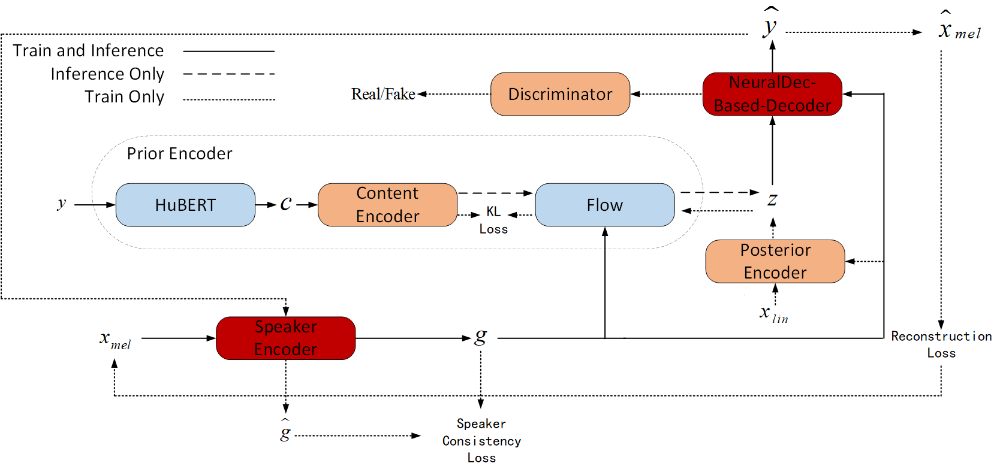

# NeuralVC Any-to-Any Voice Conversion Using Neural Networks Decoder For Real-Time Voice Conversion


In this paper, we adopt the end-to-end [VITS](https://arxiv.org/abs/2106.06103) framework for high-quality waveform reconstruction. By introducing HuBERT-Soft, we extract clean speech content information, and by incorporating a pre-trained speaker encoder, we extract speaker characteristics from the speech. Inspired by the structure of [speech compression models](https://arxiv.org/abs/2210.13438), we propose a **neural decoder** that synthesizes converted speech with the target speaker's voice by adding preprocessing and conditioning networks to receive and interpret speaker information. Additionally, we significantly improve the model's inference speed, achieving real-time voice conversion.


Visit our [demo page](https://olawod.github.io/FreeVC-demo) for audio samples.

We also provide the [pretrained models](https://1drv.ms/u/s!AnvukVnlQ3ZTx1rjrOZ2abCwuBAh?e=UlhRR5).

<table style="width:100%; text-align:center;">
  <tr>
    <td style="text-align:center;"></td>
  </tr>
  <tr>
    <th>Model Framework</th>
  </tr>
</table>


## Pre-requisites

1. Clone this repo: `git clone https://github.com/zzy1hjq/NeutralVC.git`

2. CD into this repo: `cd NeuralVC`

3. Install python requirements: `pip install -r requirements.txt`

4. Download the [VCTK](https://datashare.ed.ac.uk/handle/10283/3443) dataset (for training only)


## Inference Example

Download the pretrained checkpoints and run:

```python
# inference with NeuralVC
# Replace the corresponding parameters
convert.ipynb
```

## Training Example

1. Preprocess

```python

# run this if you want a different train-val-test split
python preprocess_flist.py

# run this if you want to use pretrained speaker encoder
python preprocess_spk.py

# run this if you want to use a different content feature extractor.
python preprocess_code.py

```

2. Train

```python
# train NeuralVC
python train.py


```

## References

- https://github.com/jaywalnut310/vits
- https://github.com/OlaWod/FreeVC
- https://github.com/quickvc/QuickVC-VoiceConversion
- https://github.com/facebookresearch/encodec
